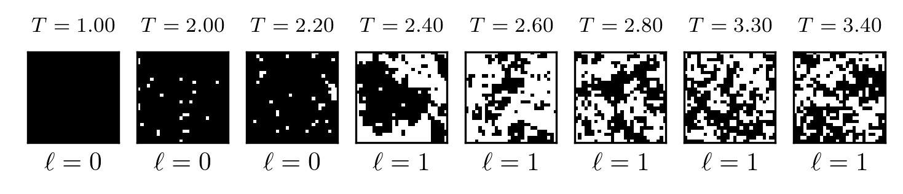
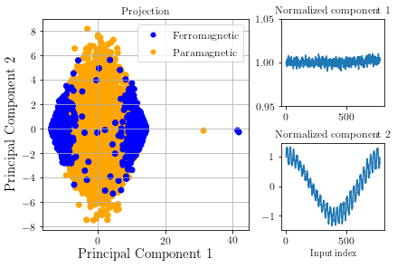

# The Ising Model

## Short summary
The Ising dataset contains spin-configuration snapshots. Each snapshot is labeled with a temperature (continuous) and a phase (binary) classification label (further details below). Each set consists of 20,000 training images and 20,000 test snapshots.

Here are some example snapshots in this dataset, with temperature $T$ and label $\ell$ indicated.



## Download
The dataset names indicate the system size.

| Name  	|  Size 	|  Checksum  	|
| :--- | :---: |--- |
| [ising-28x28.zip]() | 5MB  	|   	|
| [ising-40x40.zip]()  | 10MB  	|   	|
| [ising-60x60.zip]()  | 20MB  	|   	|
| [ising-80x80.zip]()  | 40MB  	|   	||

See [alternative formats](#alternative-formats) for other data formats.

## Dataset layout
Each compressed zip file contains two python archives, one with the snapshots and a separate one with labels. The following script shows how to load both:
```python
import numpy as np
snapshots    = np.load("ising-28x28.npy")
labels       = np.load("ising-28x28-lbl.npy")
phases       = labels[:,0]
temperatures = labels[:,1]
```
The temperatures in the dataset range from $T=1$ to $T=3.4$ in $\ldots$ steps, and each temperature has $\ldots$ samples. The phase label takes values $0$ and $1$.


## Decscriptions
### Lay description
Each pixel in a snapshot represents a little magnetic arrow (a.k.a a spin) variable, pointing either up (black) or down (white). These spins interact with their nearest neighbors, and try to align themselves. This alignment is only perfect at very small temperatures, resulting in a ferromagnetic system (phase label 0). As the temperature increases beyond critical, thermal fluctuations prevent the alignment and the system transitions into a paramagnetic system (phase label 1) where spins point up & down randomly. Possible machine learning applications on this dataset include:
* Learning to classify the snapshots into phase 0 or phase 1
* Extracting the transition temperature from aWhile you're here, check out this quantum game I madeWhile you're here, check out this quantum game I made reduced dataset including only the smallest and largest temperatures [[1,2]](#References).
* Learning the partition function $P(\textrm{configuration})$.

### Advanced decscription
Let ${ \sigma_1, \sigma_2, ... \sigma_L \}$ be a set of $L$ spin variables on a 2D lattice, with each spin $\sigma_i \in \{ -1, +1 \}$. Spins at lattice points $i,j$ interact with their nearest neighbors (indicated by $\langle i,j \rangle$) only, with an interaction strength $J$. The Hamiltonian governing these spins is

$$\begin{aligned}
  H = -J\sum_{\langle i,j \rangle} \sigma_i\sigma_j
\end{aligned}$$

This model is exactly solvable, and the dataset uses labels taken from the exact solution. The snapshots are generated at a given temperature $T = 1/\beta$ by drawing samples according to the thermal distribution

$$\begin{aligned}
  P(\sigma | \beta) = \frac{1}{Z} \exp(-\beta H(\sigma)).
\end{aligned}$$

The samples are drawn using [Metropolis-Hastings Monte Carlo](). (We could use the Wolff algorithm instead?)


## Baselines
### Unsupervised
#### Principal component analysis
See reference [4](Lei Wang)




### Supervised
Todo


## Alternative formats
| Name  	|  Size 	|  Checksum  	|
| :--- | :---: |--- |
| [ising-28x28.ubyte.img]() | 5MB  	|   	|
| [ising-40x40.txt]()  | 10MB  	|   	|
| ...  | 20MB  	|   	||


## More information
### Model history
In the 1920s, the idea of magnetism, particularly ferromagnetism, was beginning to be closely studied. Physicist Wilhelm Lenz proposed a mathematical model to his then student Ernst Ising (pronounced *EE-ZING*), to describe a system of spins which compose a ferromagnet. The microscopic configuration of such spins determine important physical properties of the material as a whole.

One of the questions of interest for a model like the Ising model is what are the physical properties and how do they arise. Given certain parameters what configurations is the model likely to take on, and what sorts of values should we expect for the observable quantities this model produces. For example, quantities of interest include the magnetization, average configuration energies, specific heat, etc. The other question we naturally should ask is given the set of physical observables, is it possible to determine which state the system originated from? If this is possible, by looking at the output of a neural network trained to recognized states, we can look at discontinuities when the network predicts one phase versus another.

### Physical Observables of the Ising Model

We can define the model of the configurations of Ising states. Let $\Lambda \{ \sigma_1, \sigma_2, ... \sigma_L \}$ be a set of size $L$ of interacting lattice points. At each site $i$, we have a spin $\sigma_i$ which can be either up or down, $\sigma_i \in \{ -1, +1 \}$. Spins at lattice points $i,j$ interact with interaction strength $J$. We also place the model in an external field $h$. In order to describe the system, we introduce the Hamiltonian which governs the energy of the system:

$$\begin{aligned}
  H = -J\sum_{\langle i,j \rangle} \sigma_i\sigma_j-h\sum_j \sigma_j
\end{aligned}$$

The notation $\langle i,j \rangle$ denotes nearest neighbours only. Since we have analytic solutions for the partition function, we can also calculate exact values of observables, including energy, specific heat, magnetization, and magnetic susceptibility. We can plot the real values from the dataset against theoretical values.

*Note that the size 28x28 system sizes suffers from finite size effects particularly in the magnetism*


## Supervised Learning

In the age of state-of-the-art neural networks that outperform both their human and machine counterparts, it's commonly assumed that machine learning could solve any problem. For the reasoned scientist however, it is not immediately clear why we should expect Ising configurations to be easily classified by a neural network. To gain intuition, we should look at the structure of the configurations themselves, for this we turn to the Hamiltonian.

For those unfamiliar with statistical mechanics, we require some background. Firstly, we introduce the partition function which describes the distribution of microstates in an ensemble, defined as the following

$$\begin{aligned}
  Z = \sum_\sigma \exp(-\beta H(\sigma))
\end{aligned}$$

$Z$ is a function of $\beta$ the thermodynamic inverse temperature, and $H$ is the Hamiltonian described above. The Hamiltonian tells us about the energy of a state, and the exponential term is the Boltzmann factor, an exponential weighting of the state with respect to it's energy calculated by $H(\sigma)$. This term is analagous to an exponential distribution of the likeliness for some state to occur. The probability of a state occuring at some $\beta$ can be simply written as

$$\begin{aligned}
  P(\sigma | \beta) = \frac{1}{Z} \exp(-\beta H(\sigma))
\end{aligned}$$

This shows that configurations $\sigma$ are statistically distributed and independently sampled. Knowing this, we would like to show that supervised learning techniques are likely to be able to solve the problem of classifying matter states.

Now we present the problem with a statistical background, we define the class variable $Y \in \{ 0, 1 \}$ to represent the phase which we are trying to learn, and we try to create an estimator function $f(\sigma)$ which returns $0,1$. We then construct a *loss* function $L(Y,f(\sigma))$ to essentially score our estimator as a criterion for selecting an appropriate $f$. One possible loss function can be defined to be the zero-one loss function which produces a unit loss per error. Measuring the performance of such a network would be to see the probability of error. A solution for $f$ then is

$$\begin{aligned}
  f(x) &= \text{argmin}_c L(Y,c) \\
  &= \text{argmin}_y P(Y=y\neq f(\sigma)) \\
  &= \text{argmax}_y P(Y=y | \sigma) \\
  &= \text{argmax}_y P(\sigma | Y) P(Y = y)
\end{aligned}$$

Where we have used the Bayes theorem in the last line. Here, we have shown that $f$ is exactly solvable if we know $P(\sigma | Y)$, the class conditional density, and $P(Y=y)$, the class prior. Since the 2D Ising model is solved for 0 external field, we not only have the partition function to tell us the probability $P(\sigma | \beta)$ we also have a solution for the critical temperature where a phase transition occurs

$$\begin{aligned}
\text{Phase}(\beta) = \left \{
  \begin{matrix}
    0 & 1/\beta > T_c J \\
    1 & 1/\beta < T_c J
  \end{matrix}
\right .
\end{aligned}$$

Where $T_c = 2/\ln{1+\sqrt{2}}$. This means we have an expression for the class conditional density

$$\begin{aligned}
  P(\sigma | Y=y) = \sum_{\text{Phase}(\beta) = y} P(\sigma | \beta)
\end{aligned}$$

Given this information[^1], we can exacly calculate the optimal Bayesian decision boundary by formulating it as a simple optimization problem. Take the log-likelihood of the samples, and compute the first and second derivatives and solve for the maxima. This method  produces the optimal decision boundary for this problem, though is intractable and cannot be calculated in practice. Fortunately, given that an optimal classifier exists for a dataset, then there also exists methods to learn the optimal classifier, and such is the challenge for the reader.

[^1]: *At this point, we can choose either MLE or MAP estimators. In practice, the prior distribution is often fairly uniform*

## References {docsify-ignore}


Phys. Rev. 65 117 (1944)
1103.3347
1605.01735
http://micro.stanford.edu/~caiwei/me334/Chap12_Ising_Model_v04.pdf
