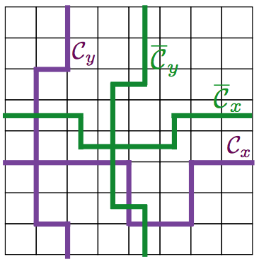

# The Z2 Lattice Gauge Theory

**This page is still under construction!**
(But the datasets are there).

## Summary
The $\mathbb{Z}_2$ dataset contains bond-configuration snapshots. Each snapshot is labeled with topological order for ground state configurations and a separate label for infinite temperature states. Each lattice site on the Ising model is replaced instead with bonds connecting to neighbouring states, which are each assigned a spin-like value in the $\mathbb{Z}_2$ ring. In 2D, each lattice site has $4$ nearest-neighbours. The configurations are stored in alternating rows of horizontal and vertical bonds.

To understand the configurations, here are some example snapshots for an $L=10$ configuration. Since rows are stacked, the configuration is stored as a $20x10$ matrix.

```
0 0 1 0 0 1 0 0 1 1
1 1 0 1 1 0 0 0 1 0
0 1 0 0 0 0 0 1 0 0
0 0 0 0 0 1 0 0 0 0
0 1 0 0 0 0 0 1 0 0
0 1 1 0 0 0 1 1 0 0
1 1 1 0 0 1 0 0 0 0
1 0 1 0 0 1 1 0 1 1
0 0 0 0 1 1 1 1 0 0
0 1 1 1 1 0 0 1 0 1
1 0 0 0 0 1 0 0 1 1
1 0 0 0 1 1 1 0 1 1
0 0 0 1 0 1 1 1 1 1
0 0 0 1 0 1 1 1 1 1
0 0 1 0 1 1 1 1 1 0
1 0 1 0 1 1 1 0 0 1
1 1 0 1 1 1 0 1 0 0
1 0 0 0 1 0 1 1 0 1
0 1 0 0 0 0 0 0 1 0
1 1 0 1 1 1 0 0 0 0
```

But this can be hard to visualize. Instead, imagine a square lattice, where on each edge connecting two lattice points, we have a spin represented by either `●` or `○`. In a different representation, the same configuration might look like

```
  ○   ○   ●   ○   ○   ●   ○   ○   ●   ●
●   ●   ○   ●   ●   ○   ○   ○   ●   ○
  ○   ●   ○   ○   ●   ●   ○   ●   ○   ○
○   ○   ○   ○   ○   ●   ○   ○   ○   ○
  ○   ●   ○   ○   ○   ○   ○   ●   ○   ○
○   ●   ●   ○   ○   ○   ●   ●   ○   ○
  ●   ●   ●   ○   ○   ●   ○   ○   ○   ○
●   ○   ●   ○   ○   ●   ●   ○   ●   ●
  ○   ○   ○   ○   ●   ●   ●   ●   ○   ○
○   ●   ●   ●   ●   ○   ○   ●   ○   ●
  ●   ○   ○   ○   ○   ●   ○   ○   ●   ●
●   ○   ○   ○   ●   ●   ●   ○   ●   ●
  ○   ○   ○   ●   ○   ●   ●   ●   ●   ●
○   ○   ○   ●   ○   ●   ●   ●   ●   ●
  ○   ○   ●   ○   ●   ●   ●   ●   ●   ○
●   ○   ●   ○   ●   ●   ●   ○   ○   ●
  ●   ●   ○   ●   ●   ●   ○   ●   ○   ○
●   ○   ○   ○   ●   ○   ●   ●   ○   ●
  ○   ●   ○   ○   ○   ○   ○   ○   ●   ○
●   ●   ○   ●   ●   ●   ○   ○   ○   ○
```

Focusing on the 4 spins in the top left corner,

```
· ○ ·
●   ●
· ○ ·
```

The 4 small dots represent lattice points on a square lattice. The 4 spins are on the bonds formed between lattice points in the square lattice. There is no lattice point in the center of the 4 bonds. The entire first row of the configuration are horizontal bonds between lattice points, and the second row represents vertical bonds between, and periodic bond conditions forms a toric lattice.

## Download

| Name  	|  Size 	|  MD5 Checksum |
| :--- | :---: | :---: |
| [Z2-40x40-npy.tar.gz](https://github.com/quantumdata/data/releases/tag/v0.1-z2-npy) | 15.5MB  	|   f5e42719c876b6a7cb5ce3522ce578ea	|
| [Z2-60x60-npy.tar.gz](https://github.com/quantumdata/data/releases/tag/v0.1-z2-npy)  | 34.9MB  	|   56935d8640bdd628489cf35ef3c6034f	|
| [Z2-80x80-npy.tar.gz](https://github.com/quantumdata/data/releases/tag/v0.1-z2-npy)  | 62.1MB  	|   83cd94cbf8dbce0837c184f5d3ca9b98	|

See [alternative formats](#alternative-formats) for other data formats.

## Dataset layout
Each compressed zip file contains two python archives, one with the snapshots and a separate one with labels. The following script shows how to load both:

```python
import numpy as np
snapshots    = np.load("z2-28x28.npy")
labels       = np.load("z2-28x28-lbl.npy")
```
Half of the configurations are ground state configurations, another half is "infinite T" states which are fully randomized. The ground states contain equal numbers of all four topological sectors. The labels $\ell = 1, 2, 3, 4$ are the four topological ground states, and $\ell = 0$ for high temperature.

## More information

### Physical Description of the Model
The Z2 model is a bit more complicated than the Ising model. First, we look at the Hamiltonian

$$\begin{aligned}
  \mathcal{H} = -K \sum_\square \prod_{(i,j) \in \square} \sigma_{ij}
\end{aligned}$$

The $\square$ is not a malformed unicode character, it represents one of the square faces in the lattice, and the four bonds associated with them, we call these plaquettes. We can notice firstly that since the spins are binary $\sigma_{ij} \in {1,-1}$, products will also be binary. The $\mathbb{Z}_2$ actually refers to the ring.

Since there are four spins in a plaquette, the product of a plaquette of all "up" spins is $1$, and so is the product of all "down" spins. Therefore, we have two obvious ground states, which are the all spin up and all spin down states.

But those are not the only ground states. Since we only need an even number of spin flips for the plaquette to remain the same energy, flipping all the spins along one plaquette will make the plaquette have an identical contribution to the Hamiltonian. Unfortunately, we have flipped the contribution of all 4 adjacent plaquettes.

Based on this intuition, we might be able to come up with a general way of "creating" new ground states. All we need to do is flip the spins along plaquettes without affecting the products along any plaquette, in an even number of spins.

Consider the operator as follows:
  1. pick any lattice point
  2. take the four bonds attached to that lattice point and flip them.

For example, we select the middle lattice point and flip its spins


```
· ○ · ○ ·        · ○ · ○ ·
●   ●   ○        ●   ○   ○
· ○ · ○ ·   ->   · ● · ● ·
●   ●   ○        ●   ○   ○
· ○ · ○ ·        · ○ · ○ ·
```

Indexing the lattice point we pick by $i$, we can call this operator $G_i$ or the "star" operator at $i$, because forms a cross ($+$, or in higher dimensions with more bonds, a star). Its a simple exercise to check that the energy of this configuration remains the same.

The set of $G_i$ "generates" a stabilizer group. Explicitly, the group is generated by the product

$$\begin{aligned}
  \prod_i (I + G_i) |0\rangle
\end{aligned}$$

However, there is yet another wrinkle. There is an alternative measure in this model, one can take the product not along the plaquettes but along a contour. We define a type of contour $\mathcal{C}$ by picking lattice points and the bonds that connect them. Since our boundaries are periodic, we take a lattice point at the top edge and take a path that connects to the bottom forming a loop. We can do the same for the horizontal side. Products along these paths on a ground state all come out to the same value, and it can be shown that the stabilizer operators cannot change the value along any path. That prompts the question, what operators do not change the energy but change these values?

The answer is a similar operator along a different contour. Instead of picking a lattice point, we pick a plaquette to start at, and make a path going through other plaquettes. The bonds in this contour are the edges of the plaquettes that our path crosses. We call these contours $\overline{\mathcal{C}}$, with one vertical and one horizontal as well, all four contours are illustrated below.

<div align="center">



</div>

The operators that take products of spins along $\mathcal{C}$ contours have the same eigenstates as the Hamiltonian, since they commute. Their eigenvalues tell you the "topological sector" of that state in that direction. The operators that flip spins along $\overline{\mathcal{C}}$ also commutes with the Hamiltonian, since they flip pairs of spins and forms a closed path, so the new states are also ground states.

We can label a state by its topological sector, which is the pair $(\mathcal{C}_x, \mathcal{C}_y)$ for ground states.

## Supervised Learning
A natural machine learning task is to learn to classify low and high temperature states, which is trickier than the Ising model. Since typical configurations have a balanced number of spin "up" and "down", it isn't clear by inspection which temperature class a configuration belongs to. Network architectures that perform well on the Ising model may not perform as well on the Z2 gauge theory model.


## References
* http://qpt.physics.harvard.edu/phys268b/Lec7_Z2_gauge_theory.pdf
